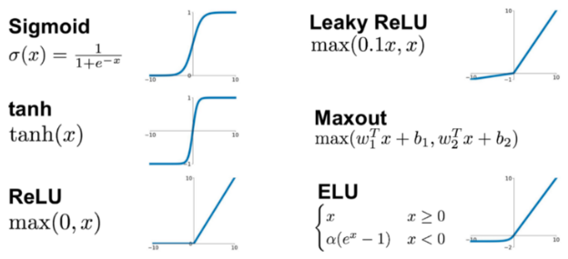
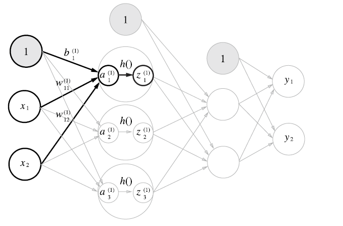
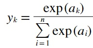
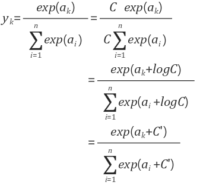

# practiceDL
Deep Learning Practice

***

## 0. Anaconda Distribution

Anaconda Distribution is a free, easy-to-install package manager, environment manager and Python distribution with a collection of 1,000+ open source packages with free community support. Anaconda is platform-agnostic, so you can use it whether you are on Windows, macOS or Linux.

[Anaconda Distribution 5 documentation](https://docs.anaconda.com/anaconda/)  
[How To Install Anaconda on Ubuntu 18.04](https://www.digitalocean.com/community/tutorials/how-to-install-anaconda-on-ubuntu-18-04-quickstart)

***

## 1. Perceptron
### Logic Gate
#### AND Gate  
[and_gate.py](https://github.com/jaeyp/practiceDL/blob/master/01.perceptron/and_gate.py?ts=4)
#### OR Gate  
[or_gate.py](https://github.com/jaeyp/practiceDL/blob/master/01.perceptron/or_gate.py?ts=4)
#### NAND Gate  
[nand_gate.py](https://github.com/jaeyp/practiceDL/blob/master/01.perceptron/nand_gate.py?ts=4)
#### XOR Gate (Multi-layer Perceptron)  
[xor_gate.py](https://github.com/jaeyp/practiceDL/blob/master/01.perceptron/xor_gate.py?ts=4)

***

## 2. Artificial Neural Network
### 2.1. Activation Function
  

#### Step Function
[step.py](https://github.com/jaeyp/practiceDL/blob/master/02.ann/activation/step.py?ts=4)  
#### Sigmoid
[sigmoid.py](https://github.com/jaeyp/practiceDL/blob/master/02.ann/activation/sigmoid.py?ts=4)  
#### ReLU (Rectified Linear Unit)  
[relu.py](https://github.com/jaeyp/practiceDL/blob/master/02.ann/activation/relu.py?ts=4)  
#### Leaky ReLU  
[leaky_relu.py](https://github.com/jaeyp/practiceDL/blob/master/02.ann/activation/leaky_relu.py?ts=4)  
#### Comparison
[activation_compare.py](https://github.com/jaeyp/practiceDL/blob/master/02.ann/activation/activation_compare.py?ts=4)  

---

### 2.2. Matrices
#### Multiplication of Matrices
[multiplication.py](https://github.com/jaeyp/practiceDL/blob/master/02.ann/matrices/multiplication.py?ts=4)

---

### 2.3. Forward Propagation
#### 3-Layer Neural Network
  

[3layer.py](https://github.com/jaeyp/practiceDL/blob/master/02.ann/forward_propagation/3layer.py?ts=4)
#### Softmax Function
  

[softmax.py](https://github.com/jaeyp/practiceDL/blob/master/02.ann/forward_propagation/softmax.py?ts=4)
#### Softmax Function (modified version)
  

[softmax_modified.py](https://github.com/jaeyp/practiceDL/blob/master/02.ann/forward_propagation/softmax_modified.py?ts=4)

---

### 2.4. MNIST
#### MNIST Inference
[minst.py](https://github.com/jaeyp/practiceDL/blob/master/02.ann/mnist/mnist.py)
#### MNIST Inference (Batch)
[minst_batch.py](https://github.com/jaeyp/practiceDL/blob/master/02.ann/mnist/mnist_batch.py)

***

## 3. Training an Artificial Neural Network
### 3.1 Loss Function
#### MSE(Mean Squared error)
Mean Squared Error is widely used in linear regression
<math xmlns="http://www.w3.org/1998/Math/MathML" display="block">
<mrow class="MJX-TeXAtom-ORD">
<mi class="MJX-tex-caligraphic-bold" mathvariant="bold-script">L</mi>
</mrow>
<mo>=</mo>
<mfrac>
<mn>1</mn>
<mi>n</mi>
</mfrac>
<munderover>
<mo>&#x2211;<!-- ∑ --></mo>
<mrow class="MJX-TeXAtom-ORD">
<mi>i</mi>
<mo>=</mo>
<mn>1</mn>
</mrow>
<mrow class="MJX-TeXAtom-ORD">
<mi>n</mi>
</mrow>
</munderover>
<mo stretchy="false">(</mo>
<msup>
<mi>y</mi>
<mrow class="MJX-TeXAtom-ORD">
<mo stretchy="false">(</mo>
<mi>i</mi>
<mo stretchy="false">)</mo>
</mrow>
</msup>
<mo>&#x2212;<!-- − --></mo>
<msup>
<mrow class="MJX-TeXAtom-ORD">
<mover>
<mi>y</mi>
<mo stretchy="false">&#x005E;<!-- ^ --></mo>
</mover>
</mrow>
<mrow class="MJX-TeXAtom-ORD">
<mo stretchy="false">(</mo>
<mi>i</mi>
<mo stretchy="false">)</mo>
</mrow>
</msup>
<msup>
<mo stretchy="false">)</mo>
<mrow class="MJX-TeXAtom-ORD">
<mn>2</mn>
</mrow>
</msup>
</math>

#### CEE(cross entropy error)
[loss_function.py](https://github.com/jaeyp/practiceDL/blob/master/03.training/loss_function/loss_function.py)
#### Loss Function with Mini Batch
[mini_batch.py](https://github.com/jaeyp/practiceDL/blob/master/03.training/loss_function/mini_batch.py)

***

## 5. Reference
#### Deep Learning from Scratch by Saito Goki (O'REILLY) [github](https://github.com/oreilly-japan/deep-learning-from-scratch)
