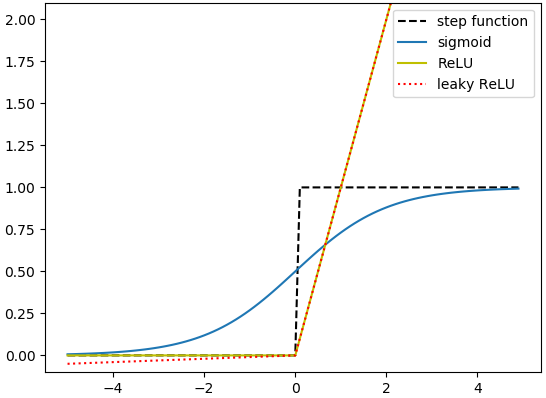

# practiceDL
Deep Learning Practice

***

## 0. Anaconda Distribution

Anaconda Distribution is a free, easy-to-install package manager, environment manager and Python distribution with a collection of 1,000+ open source packages with free community support. Anaconda is platform-agnostic, so you can use it whether you are on Windows, macOS or Linux.

[Anaconda Distribution 5 documentation](https://docs.anaconda.com/anaconda/)  
[How To Install Anaconda on Ubuntu 18.04](https://www.digitalocean.com/community/tutorials/how-to-install-anaconda-on-ubuntu-18-04-quickstart)

***

## 1. Perceptron
### Logic Gate
#### AND Gate  
[and_gate.py](https://github.com/jaeyp/practiceDL/blob/master/01.perceptron/and_gate.py?ts=4)
#### OR Gate  
[or_gate.py](https://github.com/jaeyp/practiceDL/blob/master/01.perceptron/or_gate.py?ts=4)
#### NAND Gate  
[nand_gate.py](https://github.com/jaeyp/practiceDL/blob/master/01.perceptron/nand_gate.py?ts=4)
#### XOR Gate (Multi-layer Perceptron)  
[xor_gate.py](https://github.com/jaeyp/practiceDL/blob/master/01.perceptron/xor_gate.py?ts=4)

***

## 2. Artificial Neural Network
### 2.1. Activation Function
#### Step Function
[step.py](https://github.com/jaeyp/practiceDL/blob/master/02.ann/step.py?ts=4)  
#### Sigmoid
[sigmoid.py](https://github.com/jaeyp/practiceDL/blob/master/02.ann/sigmoid.py?ts=4)  
#### ReLU (Rectified Linear Unit)  
[relu.py](https://github.com/jaeyp/practiceDL/blob/master/02.ann/relu.py?ts=4)  
#### Leaky ReLU  
[leaky_relu.py](https://github.com/jaeyp/practiceDL/blob/master/02.ann/leaky_relu.py?ts=4)  
#### Comparison
[activation_compare.py](https://github.com/jaeyp/practiceDL/blob/master/02.ann/activation_compare.py?ts=4)  
  

